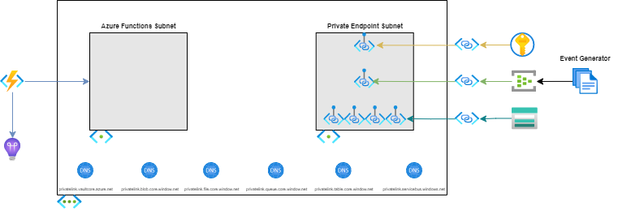

# Function App With Private Event Hub

Integration between Event Hubs and Azure Virtual Networks creates a secure messaging layer that can be accessed from other services in the network. Azure Functions can be similarly integrated with services inside virtual networks, enabling creation of workloads that execute on message ingestion, through input bindings.

## Features

This project framework provides the following features:

* An Azure Event Hub used to ingest messages.
* A Function App with a Event Hub triggered Azure Functions.
* An Azure Key Vault instance used to securely store all secret values.
* An Azure Virtual Network, Private Endpoints, and network access controls that restrict access to the Event Hub, Storage Account, and Key Vault.
* All components are deployable via Bicep or Terraform.

## Architecture

## Getting Started

### Prerequisites

* [Azure CLI](https://docs.microsoft.com/cli/azure/install-azure-cli)
* [Azure Functions Core Tools](https://docs.microsoft.com/azure/azure-functions/functions-run-local?tabs=windows%2Ccsharp%2Cbash#install-the-azure-functions-core-tools)
* [.NET](https://docs.microsoft.com/dotnet/core/install/)
* [Bicep](https://docs.microsoft.com/azure/azure-resource-manager/bicep/install) or [Terraform](https://www.terraform.io/downloads.html)

### Deploy the Infrastructure

The project can be deployed using _either_ Bicep _or_ Terraform.

#### Bicep

1. Create a new Azure resource group to deploy the bicep template to, passing in a location and name - `az group create --location <LOCATION> --name <RESOURCE_GROUP_NAME>`
2. The [azuredeploy.parameters.json](./IaC/bicep/azuredeploy.parameters.json) file contains the necessary variables to deploy the bicep project. Update the file with appropriate values. Descriptions for each parameter can be found in the [main.bicep](./IaC/bicep/main.bicep) file.
3. Optionally, verify what bicep will deploy, passing in the name of the resource group created earlier and the necessary parameters for the Bicep template - `az deployment group what-if --resource-group <RESOURCE_GROUP_NAME> --template-file .\main.bicep --parameters .\azuredeploy.parameters.json`
4. Deploy the template, passing in the name of the resource group created earlier and the necessary parameters for the bicep template - `az deployment group create --resource-group <RESOURCE_GROUP_NAME> --template-file .\main.bicep --parameters .\azuredeploy.parameters.json`

#### Terraform

1. The [terraform.tfvars](./IaC/terraform/terraform.tfvars) file contains the necessary variables to apply the terraform configuration. Update the file with appropriate values. Descriptions for each variable can be found in the [variables.tf](./IaC/terraform/variables.tf) file.
2. Initialize terraform - `terraform init`
3. Optionally, verify what terraform will deploy - `terraform plan`
4. Deploy the configuration - `terraform apply`

### Deploy the Function App Code

The project provides sample Azure Function code to verify that the solution is working correctly.

1. Navigate to the [./src/eventhub-trigger](./src/eventhub-trigger) directory.
2. Deploy the code to the function app provisioned by Bicep or Terraform - `func azure functionapp publish <FUNCTION_APP_NAME> --dotnet`

### Test the Event Hub and Function App
TODO

1. Navigate to the [Azure Portal](https://portal.azure.com) and find the Function App that was provisioned.
1. Open the **Configuration** blade.
1. Find the `AzureWebJobs.Tester.Disabled` application setting and edit the value to `false`.
1. Save the changes.
1. Find the Application Insights resource that was provisioned.
1. Open the **Logs** blade.
1. Query for the results from the `requests` table.
1. Observe the successful `EventHubProcessor` runs.

## Resources

* [Tutorial: Integrate Azure Functions with an Azure virtual network by using private endpoints](https://docs.microsoft.com/azure/azure-functions/functions-create-vnet)
* [Integrate your app with an Azure virtual network](https://docs.microsoft.com/azure/app-service/overview-vnet-integration)
* [Azure Functions networking options](https://docs.microsoft.com/azure/azure-functions/functions-networking-options)
* [Network security for Azure Event Hubs](https://docs.microsoft.com/azure/event-hubs/network-security)
* [Configure Azure Storage firewalls and virtual networks](https://docs.microsoft.com/azure/storage/common/storage-network-security)
